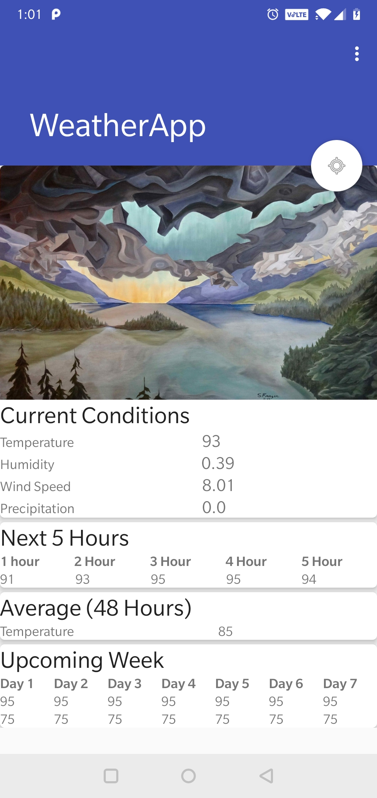
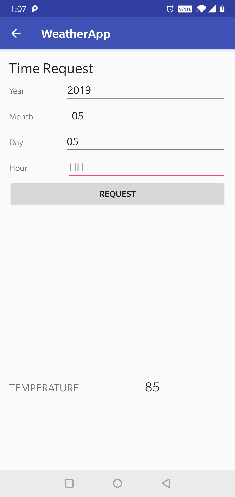

## Welcome to my Android Projects

In this page I will go over the apps that I have built and helped build in Android Studio. These projects are listed in my resume and I will go more into detail as to how they actually look and work. 

### Weather App

   

The picture above shows the two main screens of the app. On the left, is the home screen which displays conditions of your current location, as well as, give you prediction of the upcoming temperatures. On the right, is the request screen where you can fill out the date and time from the past that you are interested in and the app will give you the temperature reading. The data is retrieved using the Dark Sky API.

### Map App

Will be updated soon!

### Apartmate

Will be updated soon! 

