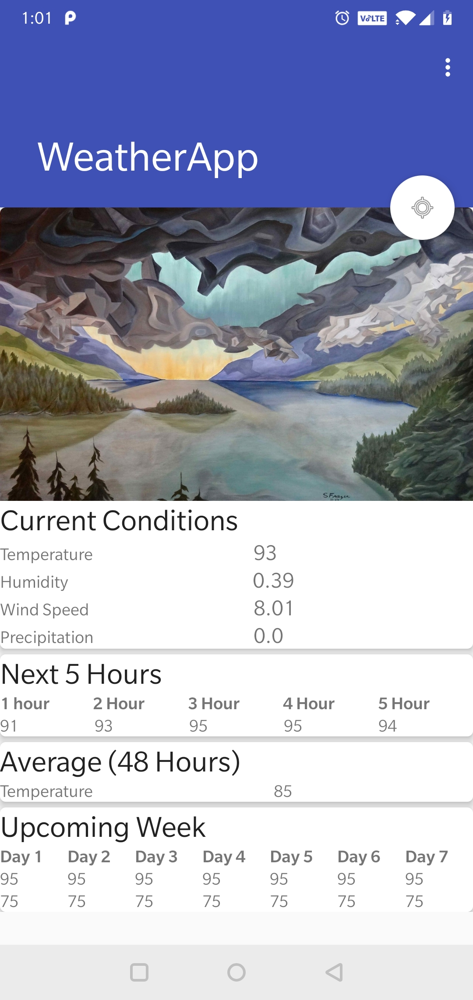
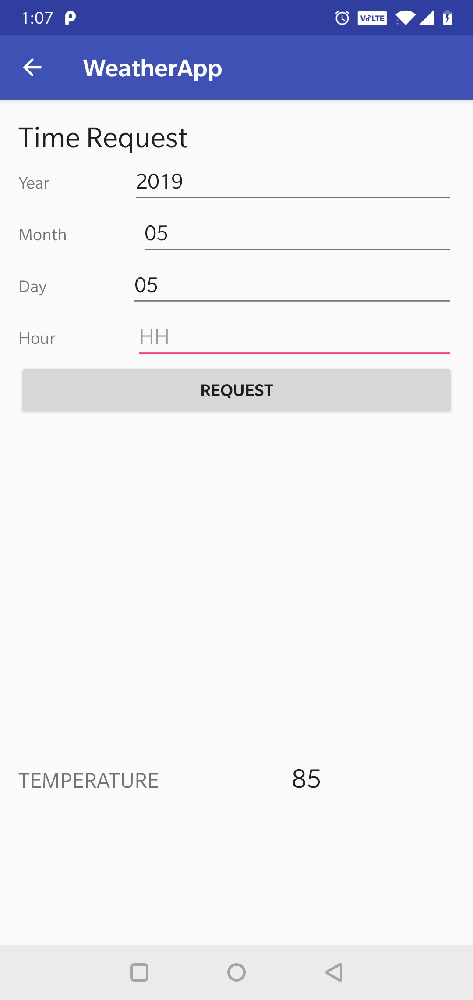
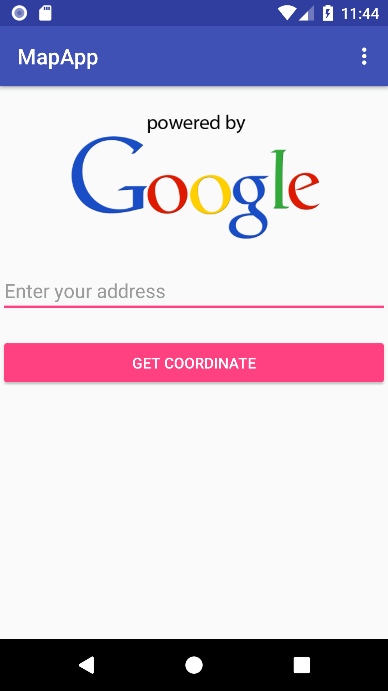
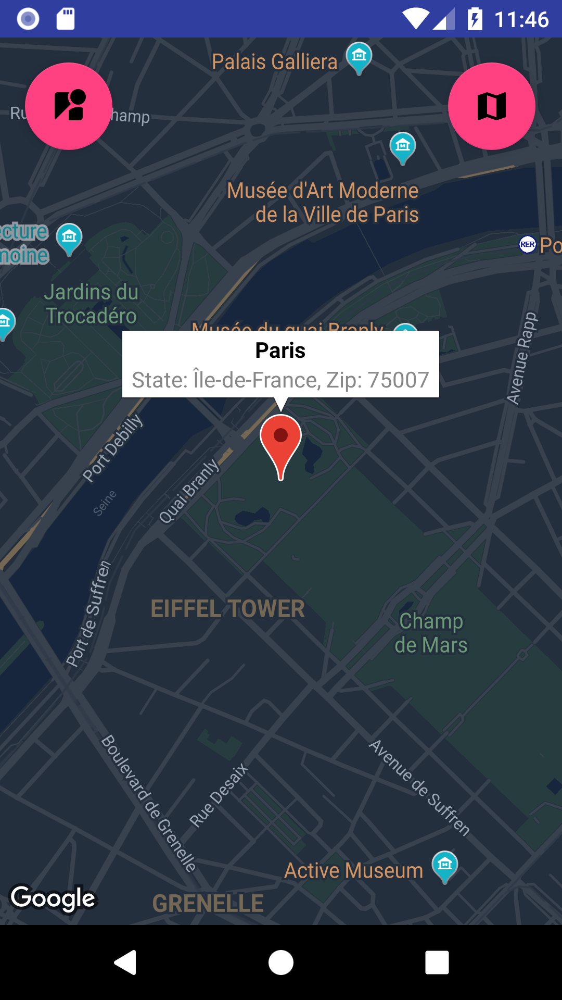
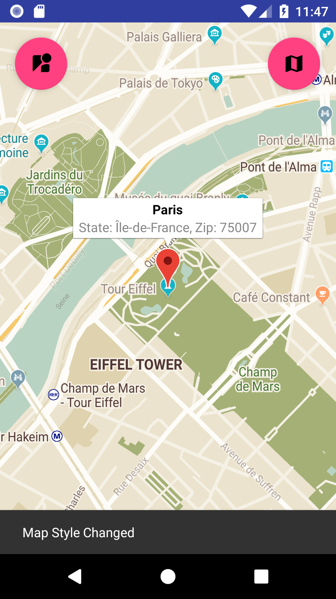
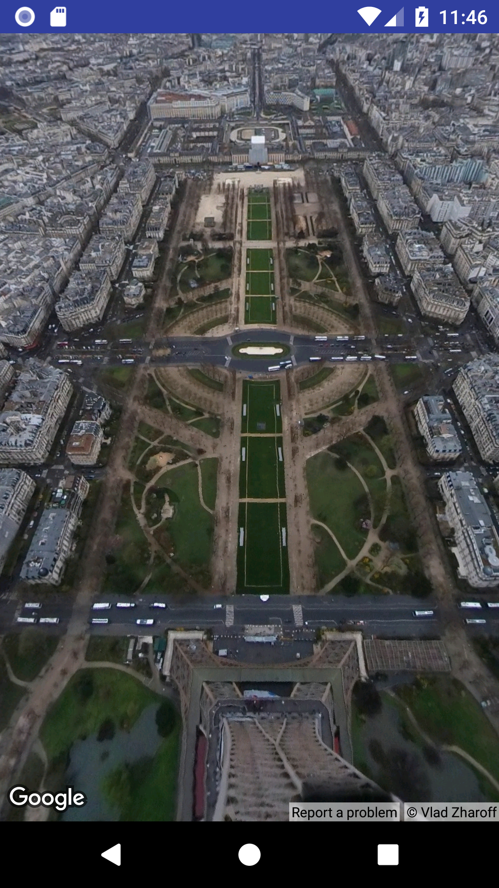

## Welcome to my Android Projects

In this page I will go over the apps that I have built and helped build in Android Studio. These projects are listed in my resume and I will go more into detail as to how they actually look and work. 

### Weather App

   
> _Image by Spencer Frazer, "Storm Shudders"_

The pictures above show the two main screens of the app. On the left, is the home screen which displays conditions of your current location, as well as, give you prediction of the upcoming temperatures. On the right, is the request screen where you can fill out the date and time from the past that you are interested in and the app will give you the temperature reading. The data is retrieved using the Dark Sky API.

### Map App
_by Saman Merchant and Farhan Rahman_

   

Our app uses the Google Map API and Geocode API to retrieve the latitude, longitude, and ZIP of a given address or location. Upon successfully getting a location we can then view it from a Map view and look at the surroundings. 

       

The Google API provides multiple themes that the map can be shown with. We added a floating button on the top right to iterate through a couple of the options so that you can pick a theme of your taste. There is also another button on the top left that takes you to a street view of the address you put in. 

   
Normally you would see the street of an address that you put, however, since I searched an iconic location I am seeing a spherical view from the eiffel tower.

### Apartmate
_by Amber Hokama, Saman Merchant, Matthew Nusgrove, and Farhan Rahman_



